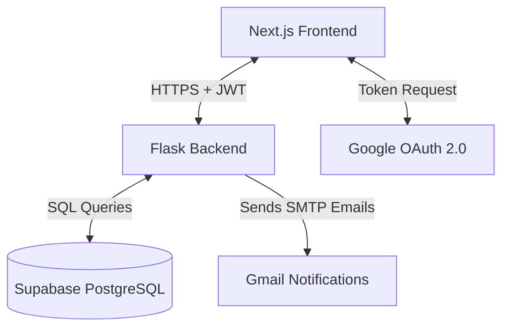

# TaskFlow: Task Management System

TaskFlow is a modern, full-stack Task Management application featuring secure **Google Sign-In**, real-time **email notifications**, and a responsive **SaaS dashboard**.

The application is split into two parts:
1. **Backend API**: A Flask application built with python, PostgreSQL (Supabase), and JWT authentication.
2. **Frontend App**: A Next.js 15 application using TypeScript, Tailwind CSS v4, and TanStack Query.

---

## 🏗️ System Architecture

TaskFlow uses a modern, lightweight client-server architecture with state synchronization.



### How the Parts Connect

1. **Authentication Flow (Google Auth & JWT)**:
   * The user clicks the **Google Sign-In** button in the Next.js frontend.
   * Google verifies the login and returns a secure **ID Token** to the client browser.
   * The frontend sends this ID token to `POST /api/auth/google`.
   * The backend validates the Google token. If the user doesn't exist, it automatically creates a new database profile.
   * The backend signs a custom **JWT Token** and returns it alongside the user profile data.
   * The frontend stores this JWT in `localStorage`.
   * **Route Protection**: If no token is in storage, the frontend automatically redirects the user to `/login`. If the backend returns a `401 Unauthorized` (e.g. token expired), the Axios client wipes the storage and redirects the user back to the login portal.

2. **Database & Queries (Supabase PostgreSQL & React Query)**:
   * The frontend uses **TanStack Query (React Query)** to fetch tasks. It reads data from `/api/tasks/` using **Axios**.
   * Outgoing requests automatically include the `Authorization: Bearer <jwt_token>` header through a central Axios Interceptor.
   * The database holds standard SQL tables with relational constraints: when a task is created, a relationship references the user who created it, and the user who is assigned to it.

3. **Background Email Notifications (Gmail SMTP)**:
   * When a user creates a task and assigns it to a colleague, the backend sends an email notification to the assignee via Gmail SMTP.
   * When a user updates a task status to **Completed**, the backend automatically triggers an email notification to the task creator.

---

## 📁 Repository Structure

```
d:\Hair Drama Assigment/
├── backend/                  # Flask Backend Subdirectory
│   ├── app/                  # Flask Backend Source Code
│   │   ├── auth/             # Google verification and JWT signing routes
│   │   ├── tasks/            # Tasks routing, creation, completion, deletion
│   │   ├── users/            # Team member list database routing
│   │   ├── utils/            # DB clients, auth helpers, SMTP email engines
│   │   └── __init__.py       # Flask app initializer and CORS rules
│   ├── db/                   # Database Initializers
│   │   ├── schema.sql        # PostgreSQL table and index definitions
│   │   └── setup.py          # Connection test script for database initialization
│   ├── run.py                # Local Flask server entry point (port 5000)
│   ├── requirements.txt      # Python packages list
│   └── .env                  # Backend credentials configuration
│   
├── frontend/                 # Next.js Frontend App
│   ├── src/
│   │   ├── app/              # App Router Pages (login, dashboard layouts)
│   │   ├── components/       # Global UI components (Navbar, header layout)
│   │   ├── features/         # Features components (TaskCard, TaskStats, CreateTaskModal)
│   │   ├── providers/        # Context loaders (Query Client, Auth protection)
│   │   ├── services/         # Axios API clients (auth, tasks, users)
│   │   └── types/            # TypeScript type models
│   ├── .env.local            # Local credentials and API links
│   ├── next.config.ts        # Next.js configurations (React Compiler enabled)
│   └── package.json          # Node modules and packages
```

---

## 🚀 Getting Started (Setup Guide)

Follow these steps to run the application locally on your computer.

### Step 1: Database Initialization
Before starting the servers, initialize your PostgreSQL database tables:
1. Ensure your database string is defined in `.env` in the `backend/` folder.
2. Navigate to the `backend/` directory in your terminal and run the database setup script:
   ```bash
   cd backend
   python db/setup.py
   ```
   *(This creates the `users` and `tasks` tables and configures optimal database indexes).*

---

### Step 2: Running the Backend (Flask API)

1. Make sure you have python installed.
2. Open a terminal and navigate to the `backend/` directory:
   ```bash
   cd backend
   ```
3. Set up a virtual environment:
   ```bash
   python -m venv venv
   source venv/Scripts/activate  # On Windows: venv\Scripts\activate
   ```
4. Install the required Python packages:
   ```bash
   pip install -r requirements.txt
   ```
5. Copy the environment template and set your credentials:
   ```bash
   cp .env.example .env
   ```
   Fill in your actual `DATABASE_URL`, Google Client ID, JWT Secret, and Gmail SMTP login codes.
6. Start the backend API server:
   ```bash
   python run.py
   ```
   *The server starts on `http://localhost:5000`.*

---

### Step 3: Running the Frontend (Next.js App)

1. Open a new terminal window inside the `frontend` folder:
   ```bash
   cd frontend
   ```
2. Install the node packages:
   ```bash
   npm install
   ```
3. Configure your local settings:
   ```bash
   cp .env.example .env.local
   ```
   Ensure `NEXT_PUBLIC_GOOGLE_CLIENT_ID` matches the one configured on your backend.
4. Run the Next.js development server:
   ```bash
   npm run dev
   ```
   *The web client starts on `http://localhost:3000`.*

---

## 🔗 API Endpoints Map

### Health Check
* `GET /api/health` - Verifies server health status.

### Authentication
* `POST /api/auth/google` - Verifies Google token, registers user profile, returns session JWT.
  * *Body*: `{ "id_token": "<google_token>" }`

### Users
* `GET /api/users/` - Lists all registered team members *(Authorization JWT required)*.

### Tasks
* `GET /api/tasks/` - Lists all tasks *(Authorization JWT required)*.
* `POST /api/tasks/` - Creates a new task *(Authorization JWT required)*.
  * *Body*: `{ "title": "...", "description": "...", "assigned_to": <user_id_integer> }`
* `PUT /api/tasks/<id>/status` - Updates task status to "pending" or "completed" *(Authorization JWT required)*.
  * *Body*: `{ "status": "completed" }`
* `DELETE /api/tasks/<id>` - Deletes task *(Authorization JWT required; restricted to creator)*.